# CustArea: AI-Native Customer Relationship Platform

> **An intelligent, omni-channel CRM platform that combines conversational AI, workflow automation, and modern customer engagement to deliver next-generation customer experience.**

---

## 1. Executive Overview

**CustArea** is a multi-tenant, AI-native Customer Relationship Management (CRM) platform designed to revolutionize how businesses manage customer interactions. The platform seamlessly integrates:

- **🤖 Conversational AI** — Intelligent agents with RAG (Retrieval-Augmented Generation), guardrails, and automated escalation
- **📱 Omni-Channel Messaging** — WhatsApp, Email, Phone (Voice), and Live Chat Widget
- **⚡ Workflow Automation** — Visual workflow builder with event-driven execution
- **📊 Sales Pipeline Management** — Contacts, leads, pipelines, and customer lifecycle tracking
- **🎫 Support Ticketing** — Full-featured ticketing system with macros and tags

### Key Differentiators

| Feature | Traditional CRM | CustArea |
|---------|-----------------|----------|
| AI Integration | Add-on/Limited | Native, configurable AI agents |
| Channel Support | Siloed | Unified omni-channel inbox |
| Automation | Rule-based | Graph-based workflow engine |
| Real-time Comm | Limited | WebSocket-powered voice & chat |
| Knowledge Base | Static FAQs | Vector-based semantic search |

---

## 2. System Architecture

### 2.1 High-Level Architecture

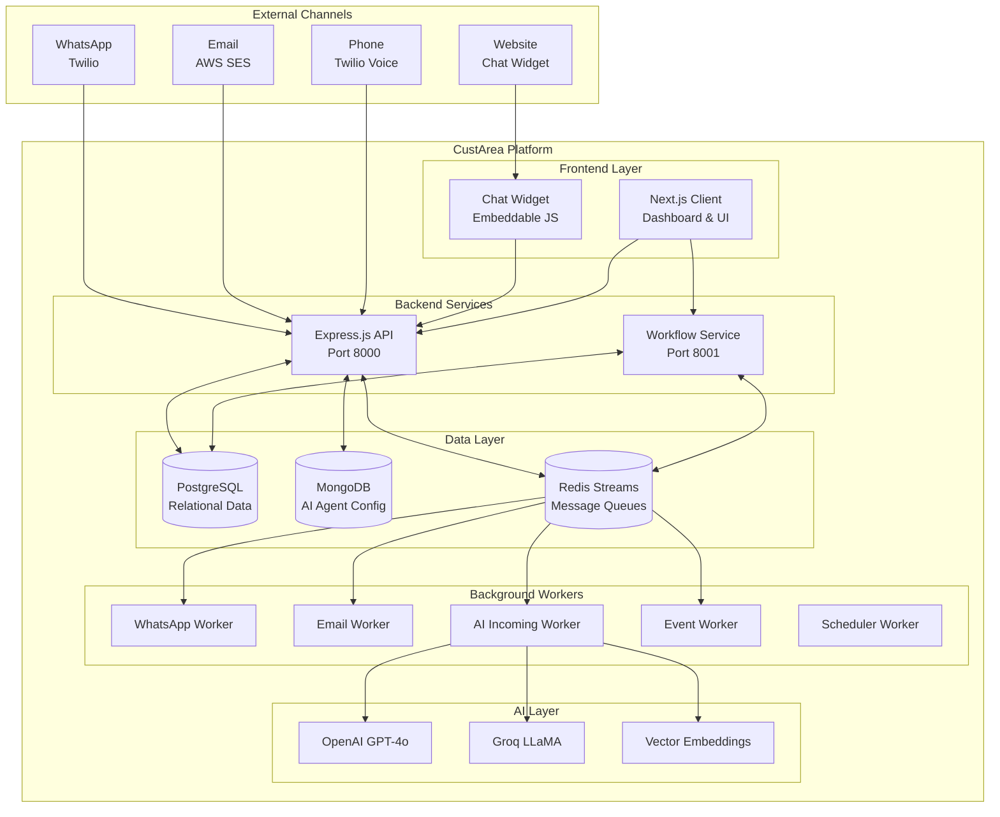

### 2.2 Service Decomposition

| Service | Technology | Port | Responsibility |
|---------|------------|------|----------------|
| **Backend API** | Node.js + Express | 8000 | Core API, webhooks, WebSocket handlers |
| **Workflow Service** | Node.js + Express | 8001 | Workflow execution, scheduling, triggers |
| **Frontend Client** | Next.js + TypeScript | 3000 | Dashboard UI, workflow builder |
| **Chat Widget** | Vite + TypeScript | N/A | Embeddable customer chat |
| **PostgreSQL** | PostgreSQL 15+ | 5432 | Core relational data |
| **MongoDB** | MongoDB 6+ | 27017 | AI agent configuration |
| **Redis** | Redis 7+ | 6379 | Message queuing, pub/sub |

---

## 3. Database Architecture

### 3.1 Entity Relationship Diagram

```mermaid
erDiagram
    TENANTS ||--o{ USERS : has
    TENANTS ||--o{ CONTACTS : owns
    TENANTS ||--o{ PIPELINES : manages
    TENANTS ||--o{ LEADS : tracks
    TENANTS ||--o{ CONVERSATIONS : maintains
    TENANTS ||--o{ TICKETS : handles
    TENANTS ||--o{ WORKFLOWS : automates
    
    CONTACTS ||--o{ LEADS : becomes
    CONTACTS ||--o{ ACCOUNTS : converts_to
    CONTACTS ||--o{ CONVERSATIONS : participates
    
    PIPELINES ||--|{ PIPELINE_STAGES : contains
    PIPELINE_STAGES ||--o{ LEADS : holds
    
    LEADS }o--|| USERS : assigned_to
    CONVERSATIONS ||--|{ MESSAGES : contains
    
    WORKFLOWS ||--|{ WORKFLOW_VERSIONS : versioned_by
    WORKFLOWS ||--o{ WORKFLOW_RUNS : executes
    WORKFLOW_RUNS ||--|{ WORKFLOW_RUN_NODES : tracks
    
    TENANTS {
        uuid id PK
        string name
        string status
        string plan
        boolean ai_enabled
        string ai_mode
    }
    
    CONTACTS {
        uuid id PK
        uuid tenant_id FK
        string name
        string email
        string phone
        string source
    }
    
    LEADS {
        uuid id PK
        uuid tenant_id FK
        uuid contact_id FK
        uuid pipeline_id FK
        uuid stage_id FK
        uuid owner_id FK
        string status
        int score
    }
    
    CONVERSATIONS {
        uuid id PK
        uuid tenant_id FK
        uuid contact_id FK
        string channel
        string status
        string ai_mode
    }
    
    MESSAGES {
        uuid id PK
        uuid conversation_id FK
        string direction
        string role
        string channel
        text content_text
        string status
    }
    
    WORKFLOWS {
        uuid id PK
        uuid tenant_id FK
        string name
        boolean is_active
    }
    
    TICKETS {
        uuid id PK
        uuid tenant_id FK
        uuid contact_id FK
        string subject
        string status
        string priority
    }
```

### 3.2 Multi-Tenancy Model

CustArea implements a **shared database, shared schema** multi-tenancy model with tenant isolation enforced at the application layer:

- Every table includes `tenant_id` foreign key
- Row-level filtering applied to all queries
- Tenant-specific configurations stored in `tenant_settings`
- Per-tenant WhatsApp/Email credentials in dedicated tables

---

## 4. Core Modules

### 4.1 Omni-Channel Messaging

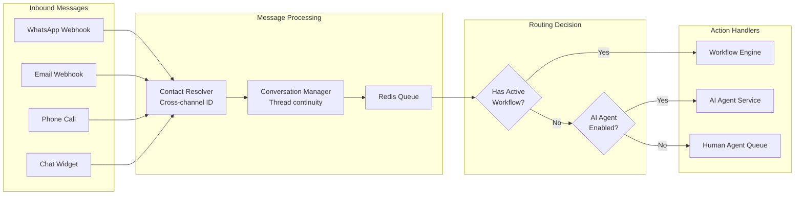

**Channels Supported:**
- **WhatsApp Business** — Via Twilio API with message status tracking
- **Email** — AWS SES for sending, webhook for receiving
- **Phone/Voice** — Twilio Voice with real-time AI conversation
- **Live Chat Widget** — Embeddable JavaScript widget for websites

### 4.2 AI Agent System

The AI Agent module provides intelligent, configurable conversational AI with enterprise-grade controls:

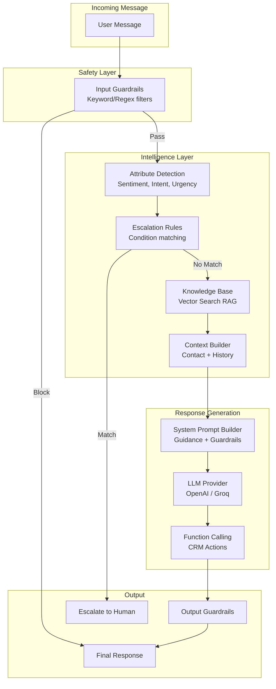

**AI Agent Features:**

| Feature | Description |
|---------|-------------|
| **Multi-LLM Support** | OpenAI GPT-4o/4o-mini, Groq LLaMA 3.1 |
| **Knowledge Base RAG** | Document ingestion with vector embeddings for semantic search |
| **Guidance System** | Configurable tone, style, and response patterns |
| **Guardrails** | Input/output filtering with keyword, regex, and AI-based detection |
| **Attribute Detection** | Automatic sentiment, intent, and urgency classification |
| **Escalation Rules** | Condition-based routing to human agents |
| **Function Calling** | CRM actions (create ticket, update lead, etc.) via tool use |

### 4.3 Workflow Automation Engine

The visual workflow builder enables no-code automation with event-driven execution:

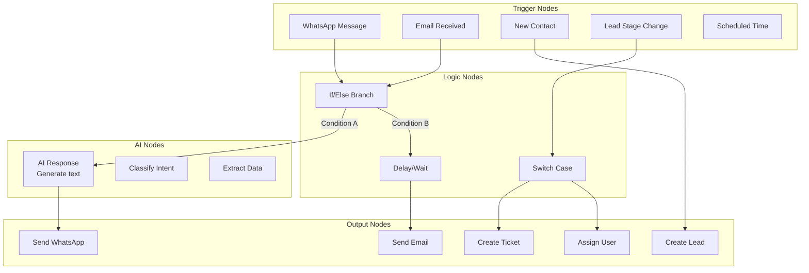

**Workflow Engine Architecture:**

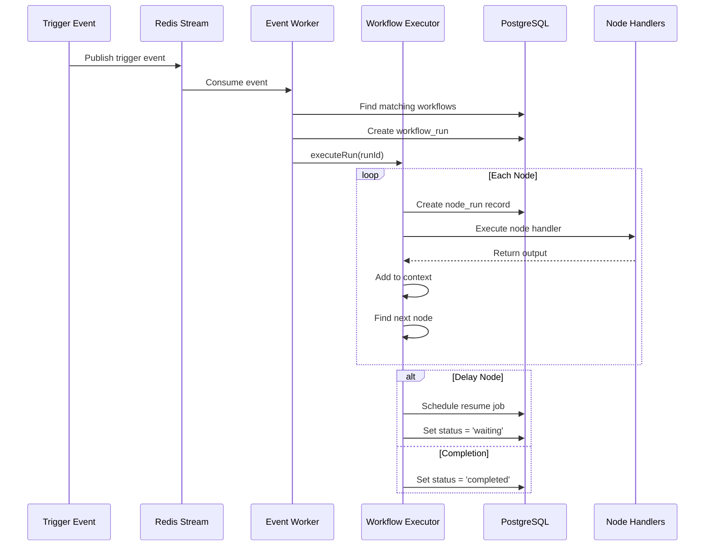

**Node Categories:**

| Category | Nodes |
|----------|-------|
| **Triggers** | WhatsApp Message, Email Received, New Contact, Scheduled |
| **Logic** | If/Else, Switch, Delay, Stop |
| **AI** | AI Response, Classify, Extract |
| **Output** | Send WhatsApp, Send Email, Create Lead, Create Ticket, Assign User |

### 4.4 Sales CRM

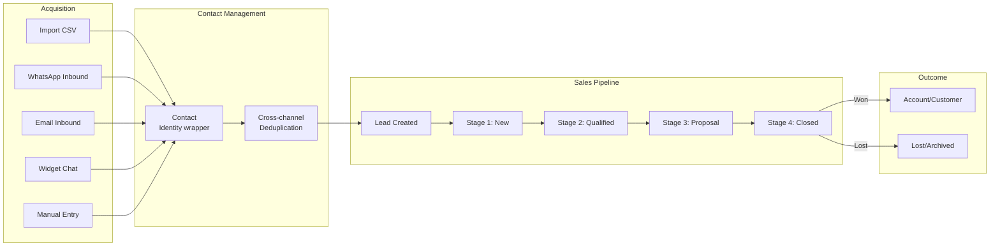

**CRM Features:**
- **Contact Management** — Unified contact identity across channels
- **Lead Board** — Kanban-style pipeline visualization
- **Pipeline Customization** — Custom stages and multiple pipelines
- **Assignment** — Manual and round-robin user assignment
- **Activity Tracking** — Complete interaction history

### 4.5 Support Ticketing

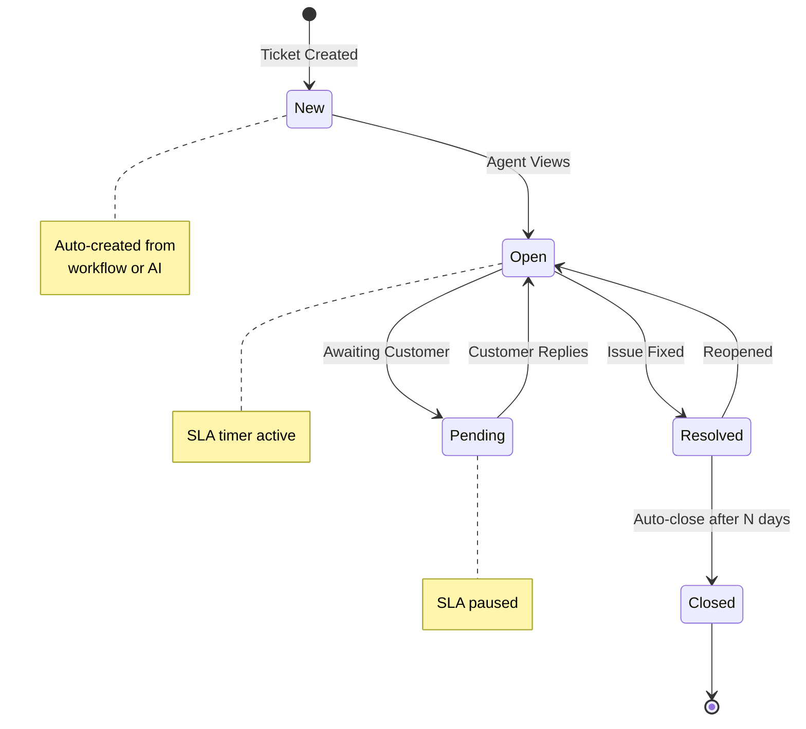

**Ticketing Features:**
- **Auto-creation** — Tickets from workflows, AI, or manual
- **Priority Levels** — Urgent, High, Normal, Low
- **Tags** — Custom categorization and filtering
- **Macros** — Pre-defined response templates
- **Assignment** — Individual or team assignment
- **SLA Tracking** — Response and resolution timers

---

## 5. Technical Workflows

### 5.1 Inbound WhatsApp Message Flow

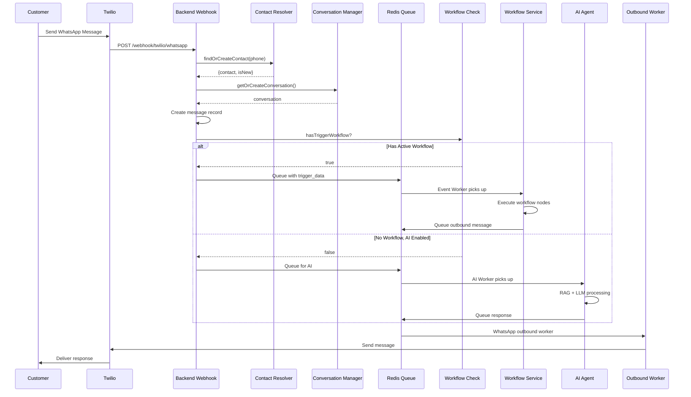

### 5.2 Workflow Execution Lifecycle

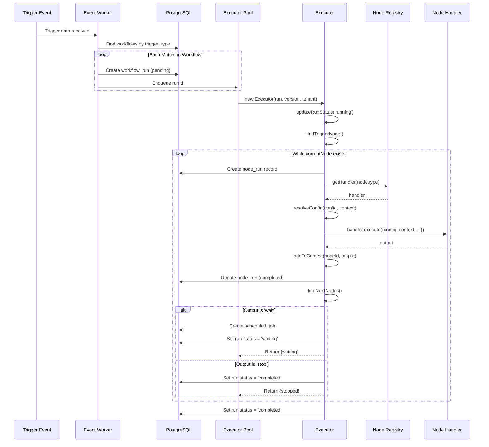

### 5.3 AI Agent Chat Processing

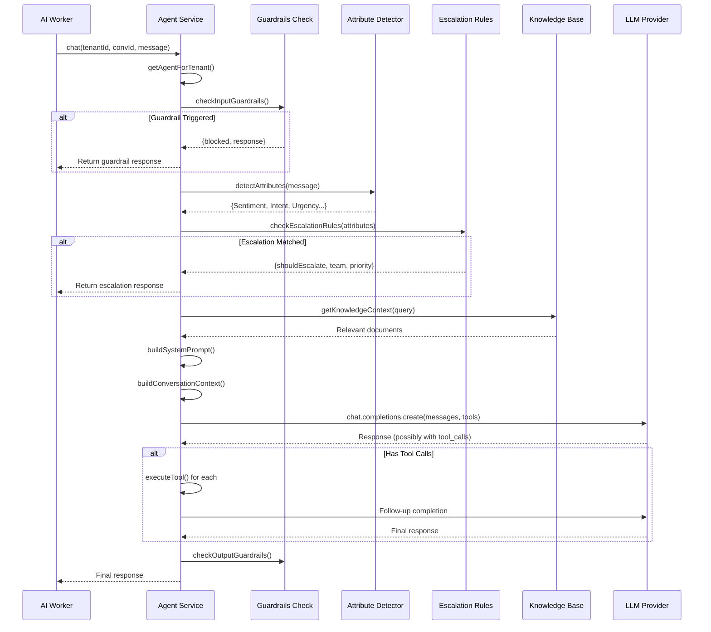

---

## 6. Technology Stack

### 6.1 Frontend

| Technology | Purpose |
|------------|---------|
| **Next.js 15** | React framework with App Router |
| **TypeScript** | Type-safe development |
| **Tailwind CSS** | Utility-first styling |
| **React Flow** | Visual workflow builder |
| **Zustand** | State management |

### 6.2 Backend

| Technology | Purpose |
|------------|---------|
| **Node.js 20+** | Runtime environment |
| **Express.js** | HTTP server framework |
| **PostgreSQL** | Primary relational database |
| **MongoDB** | AI agent configuration store |
| **Redis Streams** | Message queue and pub/sub |
| **WebSocket (ws)** | Real-time communication |

### 6.3 AI/ML Stack

| Technology | Purpose |
|------------|---------|
| **OpenAI API** | GPT-4o, GPT-4o-mini LLMs |
| **Groq API** | LLaMA 3.1 for fast inference |
| **OpenAI Embeddings** | text-embedding-3-small |
| **Vector Search** | Semantic document retrieval |
| **Azure Speech** | Speech-to-Text / Text-to-Speech |

### 6.4 External Integrations

| Service | Purpose |
|---------|---------|
| **Twilio** | WhatsApp Business API, Voice |
| **AWS SES** | Email sending |
| **Azure Cognitive** | Speech services |

---

## 7. Security & Compliance

### 7.1 Access Control

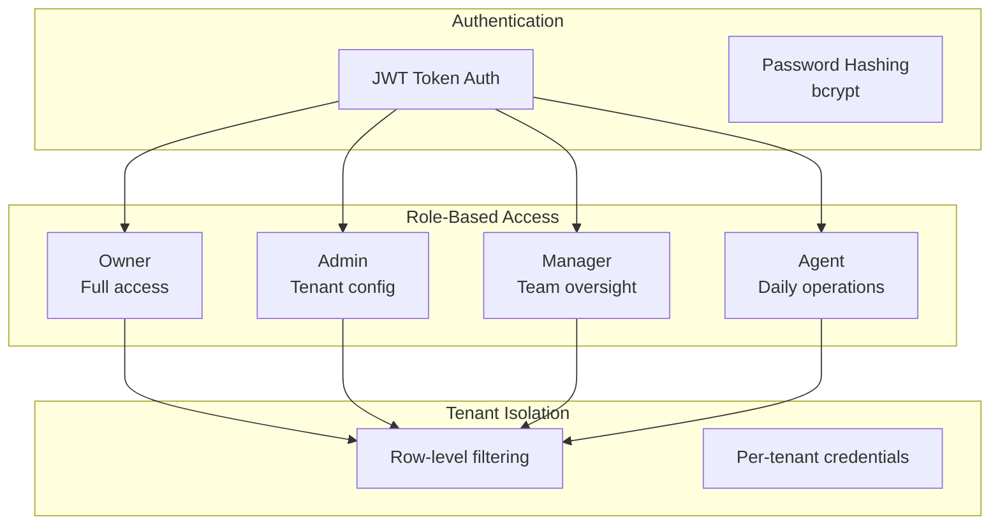

### 7.2 Security Features

| Feature | Implementation |
|---------|----------------|
| **Authentication** | JWT-based stateless auth |
| **Password Security** | bcrypt hashing |
| **API Security** | Helmet.js, CORS configuration |
| **Tenant Isolation** | Application-level row filtering |
| **Credential Storage** | Per-tenant encrypted API keys |
| **Input Validation** | Request sanitization |
| **AI Guardrails** | Content filtering for AI responses |

---

## 8. Real-Time Capabilities

### 8.1 WebSocket Endpoints

| Endpoint | Purpose |
|----------|---------|
| `/client-audio` | Browser STT streaming |
| `/openai-realtime` | OpenAI Realtime API |
| `/twilio-stream` | Twilio Media Streams |
| `/phone-ws/legacy/*` | Legacy voice handler |
| `/phone-ws/realtime/*` | Realtime AI voice |
| `/phone-ws/convrelay/*` | Conversation relay |

### 8.2 Voice AI Architecture

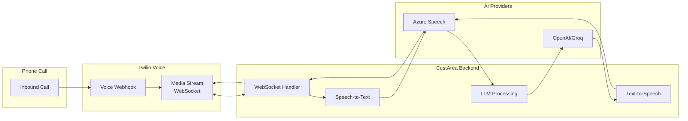

---

## 9. Observability

### 9.1 Logging & Monitoring

| Component | Tool |
|-----------|------|
| **HTTP Logging** | Morgan (dev format) |
| **Custom Logger** | Winston-compatible module |
| **Workflow Logs** | `workflow_run_logs` table |
| **Node Execution** | `workflow_run_nodes` with timing |

### 9.2 Workflow Observability

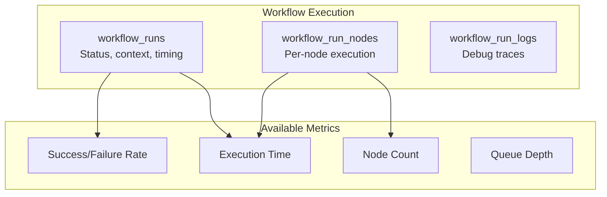

---

## 10. Project Structure

```
CustArea/
├── backend/                    # Main API Server (Port 8000)
│   ├── ai-agent/              # AI Agent Module
│   │   ├── models/            # Mongoose models (Agent, Guidance, etc.)
│   │   ├── services/          # Core AI services
│   │   │   ├── agentService.js        # Main chat processing
│   │   │   ├── embeddingService.js    # Vector embeddings
│   │   │   ├── vectorSearchService.js # RAG retrieval
│   │   │   └── functionTools.js       # LLM tool definitions
│   │   └── routes/            # AI Agent API routes
│   ├── controllers/           # Request handlers
│   │   ├── authController.js
│   │   ├── contactController.js
│   │   ├── conversationController.js
│   │   ├── leadController.js
│   │   ├── messageController.js
│   │   └── ticketController.js
│   ├── services/              # Business logic
│   │   ├── whatsappService.js
│   │   ├── contactResolver.js
│   │   └── workflowCheckService.js
│   ├── workers/               # Background processors
│   │   ├── whatsappOutbound.js
│   │   ├── emailOutbound.js
│   │   └── aiIncomingWorker.js
│   ├── phone/                 # Voice/Phone module
│   └── chat_widget/           # Widget backend
│
├── workflow-service/          # Workflow Engine (Port 8001)
│   ├── engine/               # Core execution
│   │   ├── executor.js       # Main workflow runner
│   │   ├── context.js        # Expression resolution
│   │   ├── graphTraversal.js # Node navigation
│   │   └── scheduler.js      # Delayed execution
│   ├── nodes/                # Node type handlers
│   │   ├── triggers/         # Trigger nodes
│   │   ├── logic/            # If/Else, Switch, Delay
│   │   ├── ai/               # AI response nodes
│   │   ├── output/           # WhatsApp, Email, etc.
│   │   └── registry.js       # Node type registry
│   ├── workers/              # Event processing
│   │   ├── eventWorker.js
│   │   └── schedulerWorker.js
│   └── routes/               # Workflow API
│
├── client/                   # Next.js Frontend
│   └── src/
│       ├── app/
│       │   ├── (dashboard)/  # Protected routes
│       │   │   ├── ai-agent/ # AI configuration
│       │   │   ├── campaign/ # Marketing campaigns
│       │   │   ├── conversation/ # Inbox
│       │   │   ├── dashboard/   # Overview
│       │   │   ├── sales/       # CRM module
│       │   │   ├── settings/    # Configuration
│       │   │   ├── tickets/     # Support tickets
│       │   │   └── workflow/    # Workflow builder
│       │   └── (public)/     # Auth pages
│       └── components/       # Shared UI
│
├── chat-widget/              # Embeddable Widget
│   └── widget/              # Vite + TypeScript
│
└── db/                       # Database
    ├── schema.sql           # Core schema
    └── migrations/          # Schema changes
```

---

## 11. Key Innovations

### 11.1 Cross-Channel Contact Resolution

The platform implements intelligent contact deduplication across all channels:

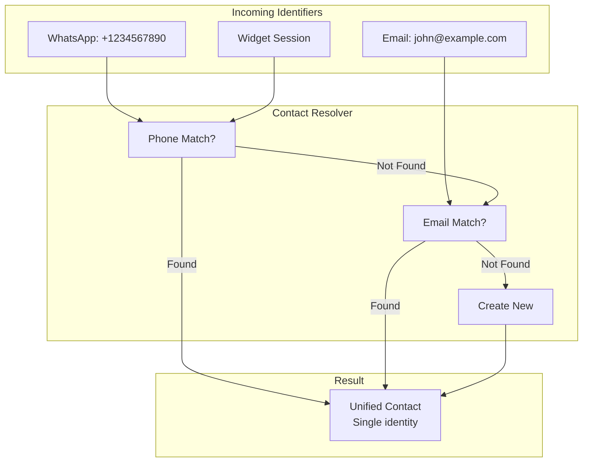

### 11.2 Workflow Context System

The workflow engine maintains a rich execution context that flows through all nodes:

```javascript
context = {
    trigger: {
        trigger_type: 'whatsapp_message',
        sender: { phone: '+1234567890', name: 'John' },
        message: { body: 'Hello!', id: 'msg_123' },
        contact_id: 'contact_uuid',
        conversation_id: 'conv_uuid'
    },
    nodes: {
        'node_1': { /* output from node 1 */ },
        'node_2': { /* output from node 2 */ }
    }
}
```

Expression resolution allows dynamic references:
- `{{trigger.sender.phone}}` → `+1234567890`
- `{{nodes.ai_response.output.text}}` → AI-generated text

### 11.3 AI Safety Architecture

Multi-layered safety controls ensure responsible AI usage:

1. **Input Guardrails** — Block harmful inputs before processing
2. **Guidance System** — Steer AI behavior with configurable prompts
3. **Attribute Detection** — Classify message characteristics
4. **Escalation Rules** — Route to humans based on conditions
5. **Output Guardrails** — Filter AI-generated responses
6. **Knowledge Grounding** — RAG reduces hallucination

---

## 12. Summary

CustArea represents a modern approach to customer relationship management, combining:

- **Unified Customer View** — Single contact identity across all channels
- **AI-First Design** — Intelligent automation with human oversight
- **Visual Automation** — No-code workflow builder for business users
- **Enterprise Controls** — Guardrails, escalation, and audit trails
- **Real-Time Engagement** — WebSocket-powered voice and chat
- **Scalable Architecture** — Microservices with event-driven processing

The platform is built for extensibility, allowing easy addition of new channels, AI capabilities, and workflow nodes as customer needs evolve.

---

*Document generated: December 2024*
